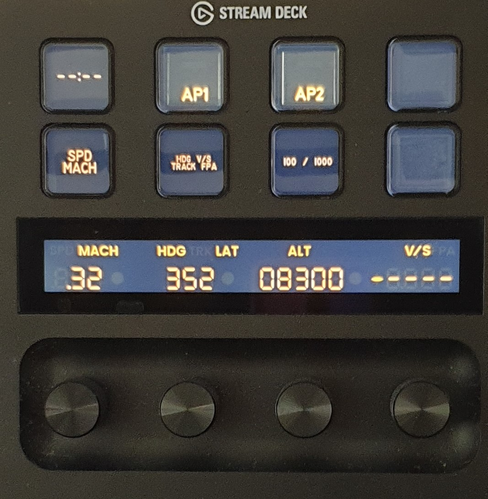

# spad.next Streamdeck+ Profile for the FenixSim A320 FCU



This is a SD+ page profile to emulate the look of the A320 FCU display and the functionality of its rotary encoders. For the rotary encoders a short press is push, long press is pull. As as of yet we can't yet detect the tap location on the display, so out of neccesity there are also separate 3 SD buttons to toggle between SPD and MACH, between HDG and TRK, and between 100 and 1000 increments.

While you'll have to fix file paths and grab some additional stuff I can supply to you directly, all my own custom assets are included here.

# Installation

Click on the `<> Code` button in GitHub and download this repository as a zip file.

Install FenixQuartz and the fonts. See [FenixQuartz](#-fenixquartz) and [Fonts](#-fonts) below for more info on those.

Now use the SPAD.neXt data monitor to make sure the `FNX2PLD_*` vars are present with the Fenix loaded and FenixQuartz running. Once that is solved you can proceed setting up this profile.

You'll need to put the images and sound file in your SPAD.neXt folder, see [Additional Assets](#-additional-assets) for a short description of those.

* `StreamdeckImages\Lianna` should be copied to your documents folder as `Documents\SPAD.neXt\StreamdeckImages\Lianna`, or rename it if you like. Just make sure you know where they are.
* `Click.mp` can go anywhere you like, I've put it in a folder `Documents\SPAD.neXt\Sound\Foley` that I created.


Now open `sdplus page profile.xml` with your favourite text editor (Notepad++ is really good) and go to the bottom of the file. You should fix all the file paths here so they point to the location of your own folder. Manually change them here, or do a search-and-replace to fix `D:\Users\Lianna\Documents\` to the location of your own spad.next folder (usually `C:\Users\<yourname>\Documents\`). It'll save a little bit of time doing it in this file rather than fixing the images through the SPAD.neXt UI, but you can fix them all through the UI as well. You can while you're at it also search for fix the paths to the `Click.mp3` file.

Once the file paths have been fixed select all the text, and copy it to the clipboard. Now go to SPAD.neXt to your StreamDeck Plus, and hit Control-V to page the page. Select NO to add it as a new page, and you should be done (you might want to re-order your pages).

# Fonts

The included font is a slightly modified version of the "Classic Mini" variant of the open source DSEG7 font: https://github.com/keshikan/DSEG (I removed the "hanging lip" on the 7 digit as an Airbus does not have that).

I also make use of the MS 33558 Airbus-like font. I don't have the distribution rights to that font file so I have not included it. Get it from e.g. https://www.wfonts.com/font/ms-33558

You'll have to install both fonts to your Windows installation.

# FenixQuartz

In order for this profile to work with the Fenix you need to install FenixQuartz so the LVARs are accessible to spad.next; get it from https://github.com/Fragtality/FenixQuartz (read the instructions!) and make sure the config has these values set:

```xml
<?xml version="1.0" encoding="utf-8" ?>
<configuration>
  <appSettings>
    <add key="debugGUI" value="false" />
    <add key="FenixExecutable" value="FenixSystem" />
    <add key="logFilePath" value="FenixQuartz.log" />
    <add key="logLevel" value="Debug" />
    <add key="waitForConnect" value="true" />
    <add key="offsetBase" value="0x5408" />
    <add key="rawValues" value="true" />
    <add key="useLvars" value="true" />
    <add key="updateIntervall" value="100" />
    <add key="altScaleDelim" value=" "/>
    <add key="addFcuMode" value="false"/>
    <add key="ooMode" value="true"/>
    <add key="lvarPrefix" value="FNX2PLD_"/>
    <add key="ignoreBatteries" value="true"/>
  </appSettings>
</configuration>
```

# Additional Assets

`Click.mp3` was recorded by myself, and can be used for the rotary encoders on your streamdeck profile; this is helpful when changing the variable doesn't animate the controls on your FCU (and thus makes no sound). It's already set up in the profile, but you'll have to fix the path to your sound file.

All images have been captured from the sim and modified and processed by myself, thus I have the copyright. 
It also includes some more images for the ECAM buttons, EFIS buttons, Engine panel, WX Radar Panel and the ATC + TCAS panel you might also find useful for your streamdeck buttons.

Note there are 4 variants of the LCD "background everything is off" image with various brightnesses, this mimics the LCD elements having been turned off while still being visible. Pick the one you like; I prefer the darkest one.

# License

Copyright 2023 Lianna Eeftinck

Permission is hereby granted, free of charge, to any person obtaining a copy of this software and associated documentation files (the “Software”), to deal in the Software without restriction, including without limitation the rights to use, copy, modify, merge, publish, distribute, sublicense, and/or sell copies of the Software, and to permit persons to whom the Software is furnished to do so, subject to the following conditions:

The above copyright notice and this permission notice shall be included in all copies or substantial portions of the Software.

THE SOFTWARE IS PROVIDED “AS IS”, WITHOUT WARRANTY OF ANY KIND, EXPRESS OR IMPLIED, INCLUDING BUT NOT LIMITED TO THE WARRANTIES OF MERCHANTABILITY, FITNESS FOR A PARTICULAR PURPOSE AND NONINFRINGEMENT. IN NO EVENT SHALL THE AUTHORS OR COPYRIGHT HOLDERS BE LIABLE FOR ANY CLAIM, DAMAGES OR OTHER LIABILITY, WHETHER IN AN ACTION OF CONTRACT, TORT OR OTHERWISE, ARISING FROM, OUT OF OR IN CONNECTION WITH THE SOFTWARE OR THE USE OR OTHER DEALINGS IN THE SOFTWARE.
